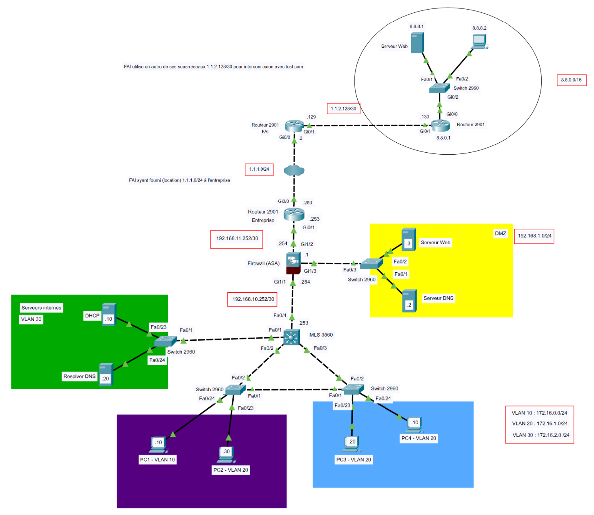

# 🔐 Secure Network Infrastructure for Small Businesses  

## 🇫🇷 Description (FR)

Projet réalisé dans le cadre du BUT Réseaux & Télécom (parcours Cybersécurité).  
L’objectif était de concevoir et sécuriser l’infrastructure réseau d’une PME fictive à l’aide de **Cisco Packet Tracer**.  

### 🎯 Objectifs du projet
- Mettre en place une infrastructure réseau complète et sécurisée  
- Documenter clairement les choix techniques et la configuration  

### 🛠️ Technologies et outils
- Cisco Packet Tracer  
- Routeurs Cisco 2901, Switchs 2960/3560  
- Firewall ASA  
- Protocoles : VLAN, DHCP, DNS, ACL, NAT  

### ⚙️ Fonctionnalités implémentées
- Segmentation en VLANs (utilisateurs, serveurs, DMZ)  
- Routage inter-VLAN et configuration DHCP/DNS  
- Mise en place d’un firewall ASA pour sécuriser les flux  
- Déploiement d’une DMZ avec serveurs Web et DNS  
- Application de règles de sécurité via ACL et NAT  

### 📂 Contenu du dépôt
- `/topology` → fichiers Packet Tracer (.pkt) et schémas réseau  
- `/docs` → rapport complet du projet (PDF, 61 pages)  
- `README.md` → résumé et présentation du projet  

### 👨‍💻 Compétences développées
- Administration et configuration réseau (Cisco PT)  
- Sécurisation des accès et gestion des flux  
- Rédaction de documentation technique claire et structurée  
- Travail en équipe sur un projet réseau complet  

---

## 🇬🇧 Description (EN)

Project carried out as part of the **Bachelor in Networks & Telecommunications (Cybersecurity track)**.  
The goal was to design and secure the IT infrastructure of a fictitious small business using **Cisco Packet Tracer**.  

### 🎯 Project objectives
- Build a complete and secure network infrastructure  
- Provide clear documentation and configuration details  

### 🛠️ Technologies & tools
- Cisco Packet Tracer  
- Cisco 2901 Routers, 2960/3560 Switches  
- ASA Firewall  
- Protocols: VLAN, DHCP, DNS, ACL, NAT  

### ⚙️ Implemented features
- VLAN segmentation (users, servers, DMZ)  
- Inter-VLAN routing and DHCP/DNS services  
- ASA firewall deployment to secure network flows  
- DMZ deployment with Web and DNS servers  
- Security rules with ACLs and NAT  

### 📂 Repository content
- `/topology` → Packet Tracer files (.pkt) and network diagrams  
- `/docs` → full project report (PDF, 61 pages)  
- `README.md` → summary and project presentation  

### 👨‍💻 Skills developed
- Network administration and configuration (Cisco PT)  
- Service hardening and access control  
- Technical documentation (clear & structured)  
- Teamwork on a complete network design project  

---

📸 *Example topology diagram:*  

